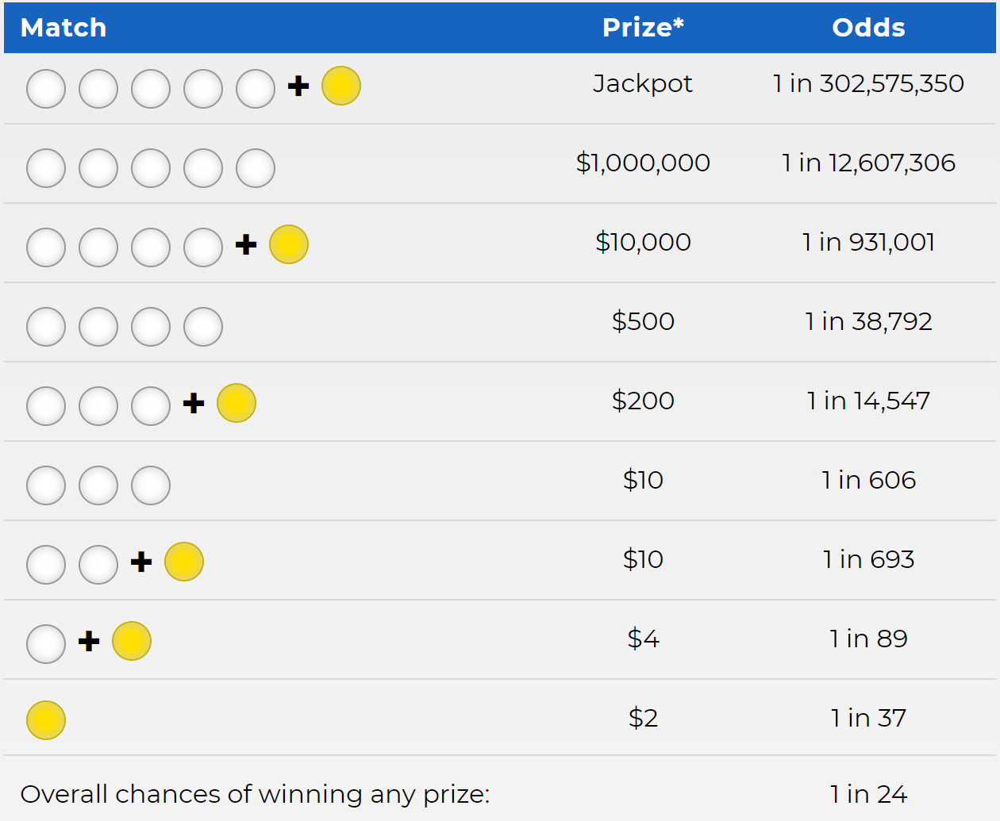

# Lottery

This is a study about predicting winning lottery numbers. The Mega Millions dates back to 1996 when it was called the Big Game. Winning Numbers are drawn twice a week and tickets are $2. Five numbers are drawn from a pool of 1-70 white balls and one number is drawn from 1-25 gold balls. You can choose the numbers yourself or you can use a Quick Pick and let the computer generate random numbers.

There are nine ways to win that include picking the correct gold ball and getting $2 to guessing all five white balls and the gold ball which will net you the jackpot. 

  
## Odds Of Winning

 The odds of winning the jackpot are 1 in 302,575,350 but the odds for getting 4 out of 5 white balls is 1 in 38,792. If we can eliminate half of the balls the odds of winning $500 increases dramatically.

## Purpose

 The purpose of this study to use data analytics methods, R and random chance to determine the winning numbers of the Mega Millions. I compare the most current data analytic methods to the quick pick method to determine the best method to pick the winning numbers.
