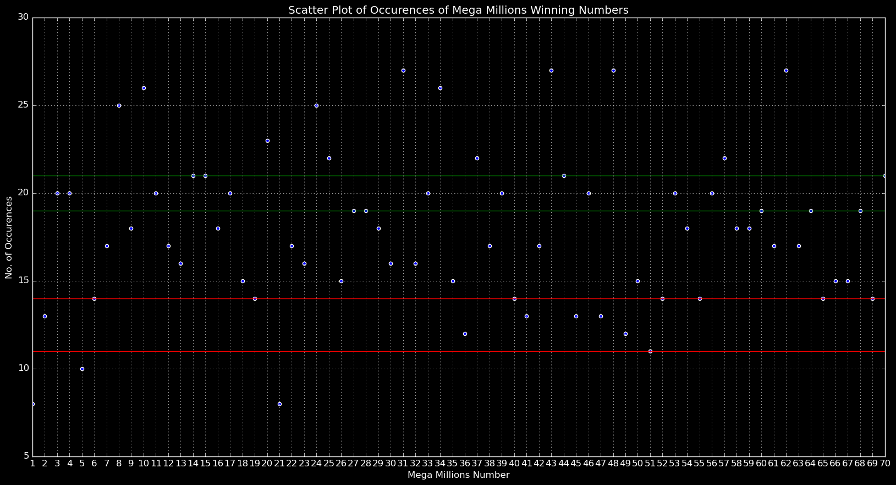

# Gaming_The_Lottery
Using statistics to predict the Mega Millions lottery numbers.
# Lottery

# Purpose
The purpose of this study is to use data analytics methods, R, Python, and random chance to determine the winning numbers of the Mega Millions. This is meant to be a fun project to reinforce statistical methods and to make a little money out of it.

# About the lottery
The Mega Millions dates back to 1996 when it was called the Big Game. Winning Numbers are drawn twice a week and tickets are $2. Five numbers are drawn from a pool of 1-70 white balls and one number is drawn from 1-25 gold balls. You can choose the numbers yourself or you can use a Quick Pick and let the computer generate random numbers.

There are nine ways to win that include picking the correct gold ball and getting $2, to guessing all five white balls and the gold ball which will net you the jackpot. 

  
## Odds Of Winning

The odds of winning the jackpot are 1 in 302,575,350 but the odds for getting 4 out of 5 white balls is 1 in 38,792. The odds of winning can increase dramatically if certain numbers can be discarded. If particular numbers are more likely to be called then it would be easier to identify winning numbers. If half of the numbers could be eliminated because they were just called or they are never called then it could be possible to win the jackpot. 

# Results

Identifying which numbers will be called is a challenge. There are numbers that are called more frequently and there are numbers that are overdue to be called. The scatter plot above shows the white balls that were drawn. Some white balls were drawn up to 7 times in the last 30 drawings while the numbers 5, 23, 32, 51, 60, 61, 65 have not been drawn in the last 30 drawings.

The chart above shows the probability of each bin being called. There are 70 white balls and the bins are in groups of 10. Numbers from 1 to 10 have a probability of 10% of being chosen while numbers from 20 to 30 have a probablity of almost 20%.

